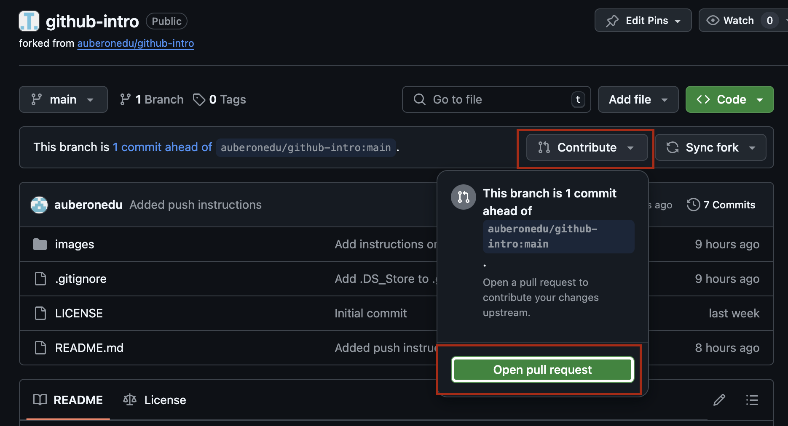

# Collectathon instructions
An exercise for collaborating with git / GitHub. Please read the directions CAREFULLY!

## Wave 1: Setup project
1. Choose one partner to be Partner A, one partner to Partner B.
1. Have ONLY Partner A fork this repository. PARTNER B SHOULD NOT FORK.
1. Have ONLY Partner A BOTH enable workflows AND switch GitHUb pages to use GitHub actions. Feel free to look back at previous instructions if you forget how to do this.
1. Have Partner A add Partner B as a collaborator on their fork. Follow [these directions](https://docs.github.com/en/enterprise-server@3.10/account-and-profile/setting-up-and-managing-your-personal-account-on-github/managing-access-to-your-personal-repositories/inviting-collaborators-to-a-personal-repository#inviting-a-collaborator-to-a-personal-repository).
1. Have the Partner A send the URL of their repository to Partner B.
1. Partner B should see an invitation at the top of the repository. Click "View Invitation", then "Accept Invitation".
1. Both partners should clone the repository to their own computer. The URL should include Partner A's username.
1. Both partners should change into the project repository:
    ```
    cd collectathon
    ```
1. Both partners should open VSCode in the project repository. If the below command does not work, open VS Code and use File > Open Folder.
    ```
    code .
    ```
1. Re-open the project in the dev container.

## Wave 2: Changes without merge conflicts
We will first practice making changes that do not trigger a merge conflict. In general, this is what we hope to happen!
1. Partner A will make changes first. ONLY PARTNER A SHOULD DO THESE SUB STEPS to add, commit, and push the changes.
    1. Do a git pull. You should get a message saying you're up to date.
        ```
        git pull
        ```
    1. Open the README.md in VS Code.
    1. Switch to editing mode of the README if it currently shows the rendered preview. Do this by clicking the piece of paper with an arrow on it in the top right corner.
    1. Make any change to the README and save it. (Note that any changes will be on the public internet, don't put anything private!)
    1. Check that the change shows up in red (shows as unstaged) when asking for the status.
        ```
        git status
        ```
    1. Add (stage) the change.
        ```
        git add README.md
        ```
    1. Check that the change shows up as green (staged for commit).
        ```
        git status
        ```
    1. Commit the change. Change the commit message to describe your commit.
        ```
        git commit -m "DESCRIBE YOUR CHANGE HERE"
        ```
    1. Push the changes to GitHub
        ```
        git push origin
        ```
1. Go to Partner A's fork on GitHub. Refresh the page and verify the changes show up.
1. Have Partner B pull Partner A's change. ONLY PARTNER B SHOULD DO THIS:
    ```
    git pull
    ```
1. Verify that the changes are downloaded locally to Partner B's computer. At this point, the code on both computers should be exactly the same.
1. Have ONLY Partner B now make a change to the README. Partner B should add, commit, and push the change following the above steps.
1. Have Partner A pull partner B's changes. Verify that the changes are downloaded locally to Partner B's computer. At this point, the code on both computers should be exactly the same again.

## Wave 3: Triggering a merge conflict
We will now artificially trigger a merge conflict. When we follow good git practices (small, frequent commits, pulling frequently) these won't happen as often. But they will happen time to time! In this part we'll get experience in resolving them once they arise.

1. Have BOTH Partner A and Partner B edit the below line (here in instructions.md, remembering to switch to edit mode if needed). Each person should make it say something different.
    ```
    line edited by Aceoomi
    E = Mc^2
    ```
1. Have BOTH Partner A and Partner B add, commit, and push the changes. You can refer to the above steps for a refresher on how to add/commit/push. One of the partners will get an error saying that their changes can't be pushed. This is OK and expected. Today we are practicing how to resolve this error.
1. Have the error partner pull the other partner's changes:
    ```
    git pull
    ```
1. There will be an message about a merge conflict. This is expected! This is what we're practicing how to resolve.
1. Have the partner who got the error run git status. It should tell you that there is a merge conflict and you both have modified `instructions.md`
    ```
    git status
    ```
1. ONLY the error partner should open the instructions.md in VSCode. There should be both changes and extra text separating them. It will look something like this:
    
1. Resolve the merge conflict to include both of the changes and delete the extra lines.
1. Mark the conflicted file as resolved with git add.
    ```
    git add instructions.md
    ```
1. Run git status again. The instructions.md should be in green.
    ```
    git status
    ```
1. Commit the confict resolution:
    ```
    git commit -m "Resolved merge conflict"
    ```
1. Push the changes to GitHub.
    ```
    git push
    ```
1. Have the other partner pull the changes and verify that both changes are there:
    ```
    git pull
    ```
1. The code should be the same on both computers. Congrats on resolving your first merge conflict!


## Wave 4: Exploring and Understanding the Game
## Running the Game
1. Both partners should compile the project. Make sure that you are in the root of the project's directory and you're in the dev container.
    ```
    make
    ```
1. Both partners should try running the game in mGBA. Race each other, see who can get 10 points first!
1. Try copying the game to the phyical GBA and make sure it works there.

## Exploring main.cpp

1. Open `planning.md`. You will be writing in this file your plans and what you understand about the code.
1. TOGETHER, look at `main.cpp`. Read through the code and try to figure out what's going on. Some parts may be new, especially the text generation and random number generation. As you go through the code, make some notes in `planning.md`. They don't need to be nicely formatted or have good grammar, just note what you're seeing, what you understand, what still doesn't quite make sense. Only focus on the "Understanding" section for now, do not worry about the other parts.
1. Pull, add, commit and push your notes! Make sure all partners pull and fix any merge conflicts if they arise.

## Wave 5: Required changes
You will be responsible for making changes to the game. MAKE SURE THAT ALL PARTNERS ARE MAKING COMMITS AND THAT YOU HAVE AT LEAST ONE COMMIT PER CHANGE. Please work together though, do NOT divide and conquer. Be talking and collaborating the whole time.

For each change, first make a plan in instructions.md. Pull, add, commit, push your plan, then implement it. Pull, add, commit and push the implementation. You will be make a lot of commits! This is good! Merge conflicts will likely arise. This is OK and natural. Resolve them as they come up.

Required changes (increasing in difficulty).
1. Change the speed of the player
1. Change the backdrop color
1. Change the starting position of the player and dot, making new `static constexpr` for starting X and Y of each
1. Make it so when the player hits start, the game restarts (the player and treasure are sent back to their initial positions and the score is reset to zero)
1. Make it so that the player loops around the screen (if they go off the left of the screen, they show up on the right, if they go off the bottom of the screen they show up at the top, etc.)
1. Make a speed boost. When the player presses 'A', their speed is increased for a short amount of time. They can only use the speed boost 3 times. They get all speed boosts back when the game is restarted by pressing start.

Again, ALL PARTNERS SHOULD BE ADDING COMMITING AND PUSHING FREQUENTLY.

## Wave 6: Make it your own!

### Brainstorming
1. Start off by brainstorming ideas of how to make this game more fun. Write these ideas in planning.md. Feel free to go wild here, don't worry about how feasible it is to implement. Take inspiration from what you've seen in the Butano examples or games you've played. A few ideas:
- How can you visibly show how many speed boosts the player has remaining?
- Can you change the way movement works to make it more interesting?
- What if there are obstacles / enemies?
- What if there is a timer?
- What sprites can you add/change?
- What if there are more interesting graphical / sound effects?
- What else???
1. Pull, add, commit, push your brainstorming.

### Making changes
1. Now, choose someting SMALL that you can feasibly change given your current skillset and the amount of time you have now. Start with something really small!
1. Make a concrete plan of how you'll do this small change in planning.md. Pull, add, commit, push.
1. Do the change! It's OK to change your plan if you run into challenges or realize what you decided to do was too big.
1. Make sure to be testing your game throughout by compiling it and playing it.
1. Pull, add commit push continously! You feature doesn't need to be finished to be making a commit. Just each time you're making some piece of progress.

Repeat the above to make AT LEAST 3 changes. Try to get more ambitious as you go: start with small changes and work your way up to bigger ones. For this part it is OK to work separately from your partner (or together if you prefer). Just make sure you coordinate! Consider playing on the real GBA as you develop.

## Wave 7: Polishing

### Playtesting
Find other players to play your game! Gather honest feedback of what they do and don't like about the graphics, gameplay, difficulty, etc.

### Improving
Improve your game in two ways:
1. Make one or more improvements to the game itself. This can include:
    - Improved graphics
    - Changed difficulty
    - New features
    - Bug fixes
1. Make one or more improvements to the code. This can include:
    - Removing of dead code / outdated comments
    - Adding new, better comments
    - Improving variable names
    - Optimizing performance
    - Refactoring
Make sure to be making commits and testing your game along the way!

### Polish and validate
1. Once you're satisfied with your game and everything is pushed, verify that it works on GitHub pages. Fix configuration if needed.
1. Make a quick gif of your game!
    1. Open your game in mGBA.
    1. Click Audio/Video > Record GIF/WebP/APNG
    1. Choose GIF, and make sure "Loop" is checked
    1. Select a location in your repo and give a name to the GIF
    1. Click Start, and play your game for a short while (probably no more than 10 seconds)
    1. Click Stop.
    1. Verify your GIF has been saved in your repo and add/commit/push the GIF.
1. Update README.md. I encourage you to look up Markdown syntax online or look at this README in edit mode for an example.
    - Give a new name to your game, and a brief description of it.
    - Add a link to the deployed GitHub page from your README.
    - Embed your GIF
    - Keep the README short, but informative and exciting. You want someone to see it and quickly have an idea of what your game is and be able to find the link to play it.
    - Add/commit/push!

### Make a Pull Request (PR)
1. ONLY ONE PARTNER NEEDS TO DO THIS STEP, BUT YOU SHOULD DO IT TOGETHER.
1. Open your GitHub repo. After refreshing the page for YOUR fork you should see a message stating that your branch is `x` commits ahead of `auberonedu/collectathon:main`. To the right of this there is a *Contribute* button. Click the *Contribute* button, and then click on the green *Open pull request* button.
  
1. This will take you to a new page. At the bottom of the page you should see a visual representation of the differences (diff) your new change will introduce. Add a title and description to your pull request (PR).
1. Click *Create pull request* to open the pull request.
1. Congrats! You have created your first pull request! For this practice exercise I will not be merging your request. But in a real open-source repository, a *maintainer* would give you feedback on your changes, and if they were happy with them the would *merge* your PR (accept your changes into the original version).

### Submitting
BOTH PARTNERS MUST SUBMIT TO CANVAS.

Submit:
- Your GitHub repo URL
- A link to your deployed game on GitHub pages
- A link to your PR
- A short description of the improvements you made